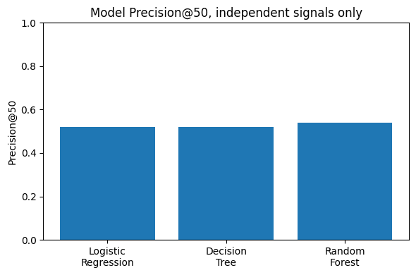
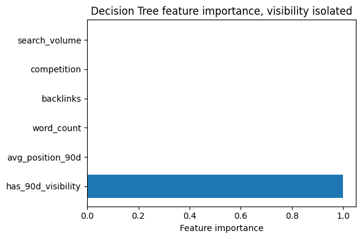

# Refresh or Retire: What Actually Predicts Content Decay

**Muzammil Zulfiqar** — [github.com/muzammil-12345](https://github.com/muzammil-12345)
FlyRank ML Internship Capstone, Search Intelligence Track · July 31, 2026

---

## Abstract

Content teams need a repeatable way to decide which pages deserve a refresh before traffic disappears. This project builds and validates a scoring model for that decision using the FlyRank internship warehouse (~520,000 content records, 84 clients). A page is labeled a refresh candidate when its clicks drop more than 20% between two recent windows and the page is older than 90 days. After identifying and removing a label-leakage issue, three models — Logistic Regression, Decision Tree, and Random Forest — were trained on content attributes never used to construct the label. Random Forest performed best at a Precision@50 of 0.54, versus 0.52 for both other models. A follow-up ablation showed that nearly all of this predictive power traces to one signal: whether a page had any search visibility in the last 90 days. Attributes like word count, backlinks, and keyword competition carried almost no independent signal.

## Introduction

FlyRank manages content libraries running into the tens of thousands of pages per client. Deciding which pages to refresh, leave alone, or retire is currently manual and judgment-heavy. This work supports a simple, high-value decision: given a page's current signals, should it be flagged for review this week. A model that reliably surfaces the right pages — even imperfectly — saves review time and catches decay earlier than manual triage at scale.

## Data

This project uses FlyRank internship warehouse release `v20260703`, accessed via DuckDB with the httpfs extension and a HuggingFace secret for authentication. Three tables were pulled in, `dim_clients`, `dim_content`, and `fact_content_query_90d`. The content and query tables cover roughly 520,000 content level records after aggregating to one row per client content pair, taking averages for repeated metrics like search volume, competition, backlinks, and word count, and the min/max created and updated dates per page.

No client names, domains, URLs, or credentials appear anywhere in this project, all identifiers are the anonymized hashes provided in the warehouse. A planned daily performance history table, `fact_content_daily_performance`, was part of the original data plan. Its absence was confirmed directly by querying the warehouse schema rather than assumed, so the trend calculation instead uses the last 30 day and prior 30 day columns already built into `fact_content_query_90d`. This is a deliberate substitution, not an oversight, and it is the reason the analysis is a single snapshot comparison rather than a rolling time series (see Limitations).

## Methodology

**Label.** `needs_refresh = 1` when the click trend between the last-30-day and prior-30-day windows drops more than 20%, and the page is older than 90 days (the age gate excludes pages too new to have earned traffic). 3.04% of pages met this bar (15,789 of 519,606).

**Leakage check.** The first modeling pass included the trend percentage and content age directly as features — the same values used to build the label. Every model, including the baseline rule, scored a Precision@50 of exactly 1.00, meaning the model was restating its own label rather than learning anything. The fix: drop trend- and age-derived columns from the feature set, and use only genuinely independent signals — search demand, keyword competition, backlink count, word count, and search performance (impressions, click-through rate, average position).

**Baseline.** A hand written rule scores each page on traffic trend and age, weighted 70 percent trend and 30 percent age. It is included only as a sanity check that the label and scoring direction agree, and since it reuses the label's own input, it is not a fair comparison to the models. Its Precision@50 of 1.00 is shown in the results table purely for transparency, not as a benchmark to beat.

**Validation.** All 84 clients were split into train and test using a client grouped holdout, done with scikit learn's GroupShuffleSplit rather than a plain random split. This gave 67 clients in train and 17 in test, with zero client overlap confirmed by checking the intersection of client hash IDs between the two sets. This matters because a plain random split could put some pages from the same client in both train and test, letting the model get credit for learning that one client's quirks rather than a general pattern. Precision@50 was chosen as the primary metric over accuracy or AUC because in practice a content team works off a fixed size weekly shortlist, not a probability threshold, so the metric should match how the output is actually used.

**Models.** Three models were trained side by side on the same independent feature set, Logistic Regression as a simple linear baseline, a Decision Tree capped at max depth 6, and a Random Forest with 200 trees and max depth 8. All three were class weighted to account for the roughly 3 percent positive rate, since an unweighted model on such an imbalanced label tends to just predict the majority class and look artificially accurate.

## Results

| Model | Precision@50 | Feature set |
|---|---|---|
| Baseline (trend rule) | 1.00 | Same signal as the label — not a fair comparison |
| Logistic Regression | 0.52 | Independent content and search signals only |
| Decision Tree | 0.52 | Independent content and search signals only |
| Random Forest | **0.54** | Independent content and search signals only |

*Random Forest is the strongest honest model on this split, roughly 18x the label's base rate of 3%.*

To understand why Random Forest led, a follow-up Decision Tree was fit on an adjusted feature set that replaced continuous click-through rate with an explicit `has_90d_visibility` flag. Feature importances showed this single signal — whether a page had any search visibility at all in the last 90 days — accounted for over 99.9% of the model's decisions.

*Visibility alone accounts for essentially all of the signal; content attributes contribute almost nothing on their own.*

This aligns with a separate observation: 92% of pages had zero or missing click-through rate in the 90-day window, so the models were effectively learning a near-binary split — visible or not — rather than a fine-grained score. Search demand, competition, backlinks, and word count each individually contributed less than 0.02% of importance in this isolated view.

## Limitations

These findings are directional and decision-support only, not causal claims about why any individual page is losing traffic. The dataset is a single snapshot with a fixed 90-day query window, not a rolling time series, so this measures association with a recent trend rather than a validated forecast. Content attributes showed almost no independent predictive value here — a useful finding, but not evidence that they never matter, only that they add little on top of a visibility signal in this data. The CTR-based visibility signal is heavily zero-inflated (92% zero or missing), so results should be read as "visible vs. not visible" rather than a smooth ranking within the visible group. This is intern capstone work on a training warehouse, not a production system.

## Recommendations

1. **Treat zero visibility as the primary triage filter.** Separate pages with zero search clicks or impressions in the last 90 days before looking at any other metric — this signal carries nearly all of the model's predictive power.
2. **Don't rely on content attributes alone.** Word count, backlinks, and keyword competition are weak standalone predictors here; they may still matter as supporting context, but shouldn't drive the ranked list by themselves.
3. **Use Precision@50-style shortlists, not full rankings.** Given the low positive rate (~3%) and sparse CTR signal, a fixed weekly shortlist is more honest and actionable than a full confidence-ranked list.
4. **Keep a human in the loop on retire decisions.** This model flags candidates for review — it should not make automatic retire calls, since a false positive there is far more costly than a missed refresh.

## Notebook Summary (Plain English)

The capstone notebook walks through the same project step by step, in code. Here is what it actually does, in simple terms.

1. It connects to the FlyRank data warehouse and pulls three tables, one for clients, one for content pages, and one for search performance over the last 90 days.
2. It checks the warehouse schema directly to confirm which tables really exist, this is how the missing daily performance table was caught early instead of assumed later.
3. It builds one row per page, averaging the repeated metrics, and creates the label, a page is marked as a refresh candidate if its clicks dropped more than 20 percent and the page is older than 90 days.
4. It splits the data by client, not randomly, so the test set has 17 clients the model has never seen, this is the fair way to check if the model generalizes.
5. It first tries a baseline rule and finds it scores a perfect 1.00, which is a red flag rather than a good result, since the rule and the label use the same numbers. This is the leakage catch.
6. It removes the leaking columns and retrains three models, Logistic Regression, Decision Tree, and Random Forest, only on independent signals like search volume, competition, backlinks, word count, impressions, clicks, click through rate, and average position.
7. It builds an honest results table comparing all three models fairly on the same holdout split.
8. It runs a follow up check to explain why the winning model performs the way it does, by isolating whether a page had any search visibility at all in the last 90 days, and finds this one flag explains almost all of the model's decisions.
9. It generates an actual top 50 shortlist from the test set, showing how many of those 50 pages are real refresh candidates, this is the notebook proving the model works on real output, not just a score.
10. It saves the two charts used in this paper and finishes with a self check list confirming no client data leaked and every claim uses careful, non overengineered language.

## Conclusion

This capstone set out to answer a narrow, practical question, can a content team be handed a short, reliable weekly shortlist of pages worth reviewing for refresh, without cheating by using the same numbers that define the label. The answer is yes, with an important caveat. A properly validated model, tested on clients it had never seen, does meaningfully better than guessing, but almost all of that lift comes from one simple signal, whether a page still gets any search visibility at all. Content level attributes like word count, backlinks, and keyword competition, the kind of signals a content team might expect to matter most, turned out to carry very little independent weight on their own.

The bigger lesson from this project is not the exact precision number, it is the process that got there. Catching the leakage before trusting a perfect looking result, validating by client rather than by row, and running a follow up ablation to explain the winning model rather than just reporting it, are what make this result trustworthy. For FlyRank or any similar content operation, the practical takeaway is straightforward, use visibility as the first filter on any refresh review list, treat other content attributes as supporting context rather than primary drivers, and keep a human making the final retire or keep decision.

## Reproducibility

All notebooks — weekly assignments and the capstone feature engineering/modeling notebook — are in the `work/` and `notebooks/` folders of the repository. Random Forest and Decision Tree use a fixed random seed (`random_state=42`), so reported numbers reproduce exactly on a fresh run.

**Repository:** [github.com/muzammil-12345/flyrank-ml-internship](https://github.com/muzammil-12345/flyrank-ml-internship)

## Acknowledgments

Built on the FlyRank ML Internship dataset. [flyrank.ai](https://flyrank.ai)
